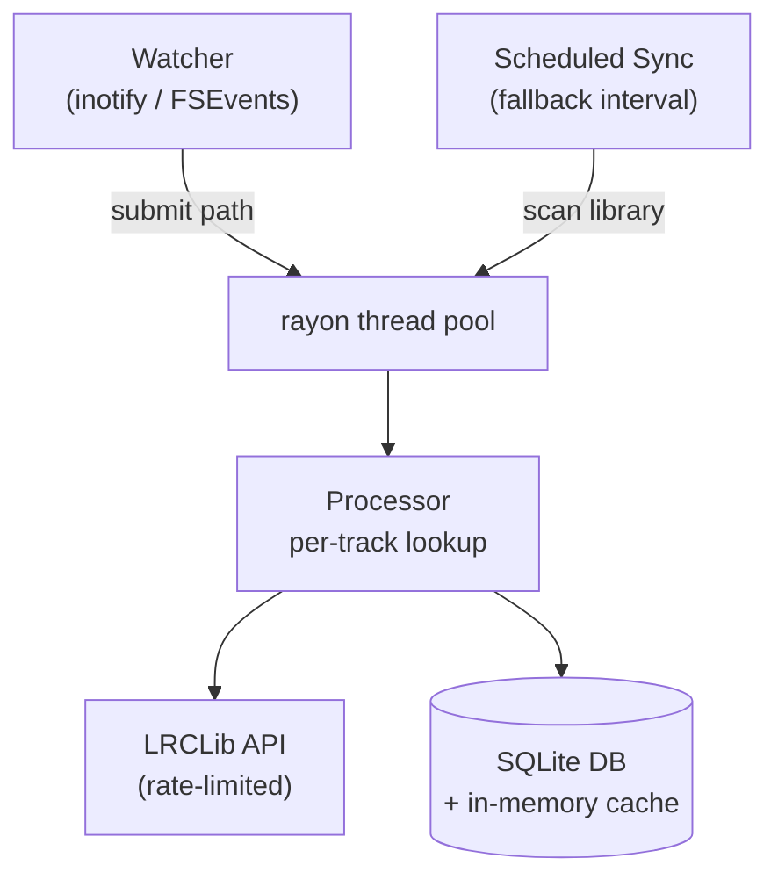

# lrc-sync

Scans a music directory, fetches lyrics from LRCLib, and writes sidecar `.lrc` files next to audio files. Watches the filesystem for new tracks and resyncs on a schedule.

Supported formats: **mp3**, **flac**, **m4a**, **ogg**, **opus**.

## Quick start

Run via Docker Compose from the project root. The compose file mounts `./config` and `./music` by default:

```sh
docker compose up -d --build
```

Override paths or tweak settings with environment variables:

```sh
LRCSYNC_DB_PATH=/path/to/config \
LRCSYNC_MUSIC_DIR=/path/to/music \
docker compose up -d --build
```

Build and run natively with Cargo:

```sh
cargo build --release && ./target/release/lrc-sync
```

## How it works

lrc-sync runs three jobs concurrently:

1. **Filesystem watcher** — monitors the music directory for file create/modify events using inotify (Linux) / FSEvents (macOS). Detected files get lyrics fetched immediately.
2. **Initial sync scan** — walks the entire music directory on startup, fetching lyrics for missing or stale tracks.
3. **Scheduled fallback scan** — re-scans the full library at a configurable interval to catch anything missed by the watcher (e.g., files added while the service was stopped).

All three share a rayon thread pool and an in-memory cache backed by SQLite. The database stores lookup results so LRCLib requests are not repeated unnecessarily. Tracks that return "not found" retry after a configurable number of days.

## Configuration

| Variable | Default | Description |
| --- | --- | --- |
| `PUID` | `1000` | Container user id. |
| `PGID` | `1000` | Container group id. |
| `TZ` | `UTC` | Timezone. |
| `LRCSYNC_CONCURRENCY` | `8` | Worker threads for scans. Range: 1–128. |
| `LRCSYNC_CLEAN_FALLBACK` | `true` | Retry lookups with cleaned metadata (strips "(Remastered)", "[Deluxe Edition]", etc.). |
| `LRCSYNC_RETRY_NOT_FOUND_DAYS` | `7` | Days to wait before retrying tracks previously not found on LRCLib. Range: 1–3650. |
| `LRCSYNC_REQUEST_INTERVAL_MS` | `750` | Minimum delay between LRCLib requests across all workers. Range: 0–60000. Set to `0` for no rate limiting. |
| `LRCSYNC_REQUEST_TIMEOUT_SECONDS` | `30` | Per-request timeout for LRCLib HTTP calls. Range: 1–300. |
| `LRCSYNC_ORPHAN_ACTION` | `keep` | What to do with unmatched `.lrc` files found during scans (see below). |
| `LRCSYNC_FALLBACK_SCAN_SECONDS` | `43200` | Interval between full rescans. Range: 60–604800. Default is 12 hours. |
| `LRCSYNC_FOLLOW_SYMLINKS` | `false` | Follow symbolic links when walking the music directory. |
| `LRCSYNC_DB_PATH` | `/config/lyrics.db` | Path to the SQLite database file (inside the container). |
| `LRCSYNC_MUSIC_DIR` | `/music` | Mount point for the music directory inside the container. |

## Orphan handling

When lrc-sync scans a directory, `.lrc` files that don't match any audio file are considered orphans. The `LRCSYNC_ORPHAN_ACTION` setting controls what happens:

- **keep** (default): Leave orphaned `.lrc` files untouched. This avoids deleting manually curated lyrics or files caught mid-transfer during a scan.
- **reconcile**: Match orphaned `.lrc` files to audio files by track number prefix or cleaned filename, then move them alongside the correct audio file.
- **quarantine**: Move unmatched `.lrc` files into a `.lrcsync-orphans/` subdirectory within their parent directory.
- **delete**: Remove all unmatched `.lrc` files permanently.

Use `quarantine` or `delete` only after checking logs. Orphaned files can be manually curated lyrics that simply don't exist on LRCLib.

## Architecture



## Build & check

Requires Rust toolchain:

```sh
make build        # Docker image, defaults to lrc-sync
make test         # Run all tests
make clippy       # Lint with warnings as errors
make fmt          # Check formatting
```

See [Makefile](Makefile) for details. The binary is `lrc-sync`.

## License

Apache License 2.0 — see [LICENSE](LICENSE).
